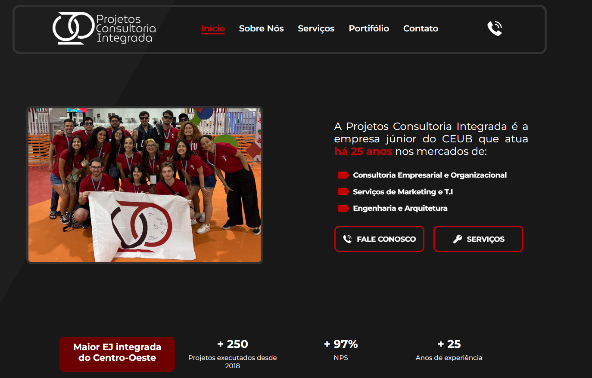

# 🌐 Site Institucional - Projetos Consultoria Integrada (PCI)

Este repositório contém o código-fonte do site institucional da **Projetos Consultoria Integrada (PCI)**, uma empresa júnior comprometida com a excelência em consultoria e soluções integradas para empresas e organizações.


---

## 📁 Estrutura do Projeto

```bash
.
PCI-SITE/
├── assets/ # Imagens, ícones e logos
│ ├── icons/
│ ├── img/
│ └── logo/
├── css/
│ └── style.css # Estilos do site
├── js/
│ └── script.js # Scripts JS do site
├── pages/ # Páginas internas do site
│ ├── sobre.html
│ ├── servicos.html
│ ├── cases.html
│ └── contato.html
├── index.html # Página inicial (Home)
└── README.md
```

## 🛠️ Tecnologias utilizadas


<br></br>
---
## 🧩 Páginas

- Home: Apresentação da empresa, parceiros e navegação principal
- Sobre: Informações sobre a história, MVV da PCI e diretores
- Serviços: Lista de serviços oferecidos
- Portifólio: Projetos, cases de sucesso e depoimentos
- Contato: Formulário de contato, mapa e informações de comunicação e localização

---

## 📫 Contato

- 🌐 Site: em progresso
- 📞 Telefone: (61) 99853-8516
- 📧 E-mail: contato@projetosintegrada.com.br
- 📍 Localização: SEPN 707/907, Ceub - Asa Norte, Bloco 2, Sala 2311 CEP: 70790-075

---

## 📝 Licença

Este projeto é de uso institucional da Projetos Consultoria Integrada. Direitos reservados © 2025.
